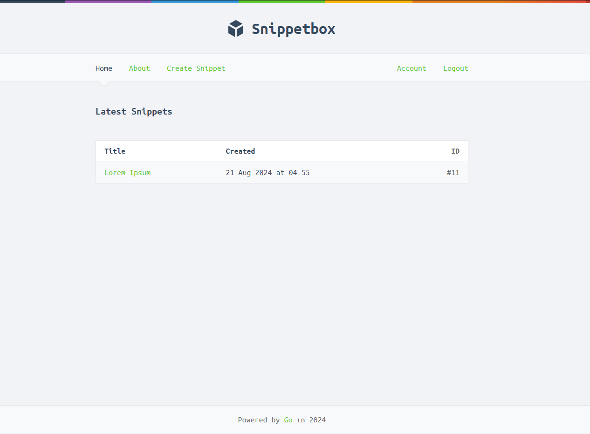

# Snippetbox



## Overview

Snippetbox was developed by coding along the [Let's Go book by Alex Edwards](https://lets-go.alexedwards.net/)

Snippetbox is a full stack web application that attempts to clone the functionality of Pastebin.

## Features

    - Account creation / Authentication
    - Snippet creation, saving and viewing
    - Data persistance through MySql
    - Dynamic HTMl through Go Templates
    - Custom Middleware
    - State Management
    - HTTPS Security
    - Embedded File Systems
    - Unit Tests
    - E2E Tests

## Executing

### Requirements:
    - MySql
    - Go Version 1.20 +

### Configuring:
Create a ".Env" file with the following properties:
```sh
SQL_USER = YourUsername
SQL_PASSWORD = YourPassword
```
Execute the following command to generate the database:
```sh
go run ./cmd/web -setup=true
```

This will generate a database called "snippetbox" that contains the following tables:
```sh
snippets(id, title, content, created, expires)
```

```sh
users(id, name, email, hashed_password, created)
```

### Starting The Application
Execute the following command:
```sh
go run ./cmd/web
```

### Testing
Execute the following command to run the included test suite:
```sh
go test -v ./...
```
